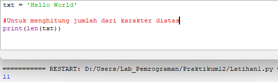
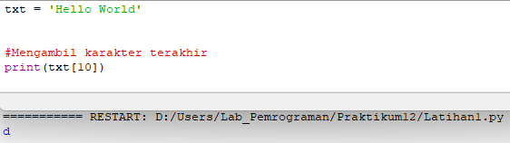
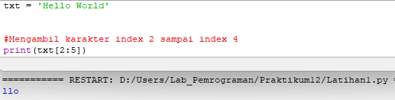
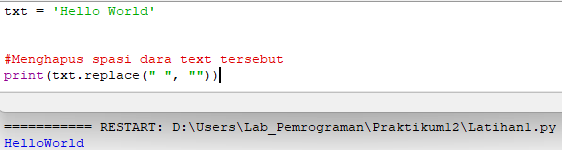
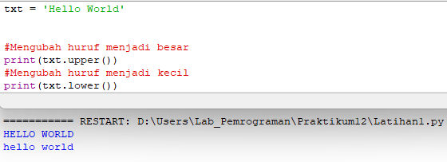
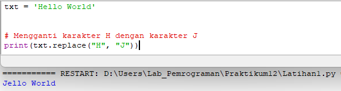
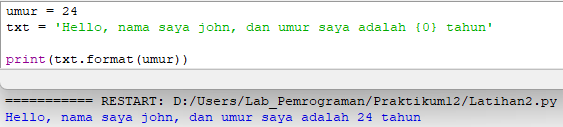

# Praktikum12
| No.| DAFTAR ISI | FILE        | GOTO                         |
|----|------------|-------------|------------------------------|
| 1. | Pengertian |             | [Menuju Kesini](#pengertian) |
| 2. | Latihan 1  | Latihan1.py | [Menuju Kesini](#latihan_1)  |
| 3. | Latihan 2  | Latihan2.py | [Menuju Kesini](#latihan_2)  |
| 4. | Penutup    |             | [Menuju Kesini](#penutup)    |

Bertemu lagi dengan Saya Rhendy pada pertemuan 14, praktikum ke 12. Pada repository praktikum12 ini,  Saya akan kembali
melakukan dua buah latihan. Latihan ini berisi tentang "Python String". Langsung saja masuk ke inti dari repository ini.

## Pengertian
Apa itu String? String adalah jenis tipe data yang populer di python. Untuk membuatnya kita hanya perlu melampirkan
karakter didalam sebuah tanda kutip. Python memperlakukan tanda kutip tunggal sama dengan tanda kutip ganda. Membuat 
string, semudah seperti saat kita memberi nilai kepada variabel.<br/>
Contoh dari string :<br/>
```
var1 = 'Hello World!'       # penggunaan petik tunggal
var2 = "Python Programming" # penggunaan petik ganda
```
Python tidak mendukung tipe data char / karakter. Untuk mengakses substring harus digunakan tanda kurung siku.<br/>
Contohnya adalah :
```
var1 = 'Hello World!'           # penggunaan petik tunggal
var2 = "Python Programming"     # penggunaan petik ganda

print("var1[0]: ", var1[0])     # mengambil karakter pertama
print("var2[1:5]: ", var2[1:5]) # karakter ke-2 s/d ke-5
```
Kita juga bisa memperbarui string yang ada dengan (kembali) menugaskan variabel ke string lain. Nilai baru dapat 
dikaitkan dengan nilai sebelumnya atau ke string yang berbeda sekalipun.<br/>
Contohnya seperti :
```
message = 'Hello World'
print ("Updated String :- ", message[:6] + 'Python')
```
Itulah pengertian singkat dari python string. Selanjutnya, Saya akan melakukan sebuah latihan mengenai cara menggunakan
pyhton string.<br/>
## Latihan 1
Untuk latihannya saya akan menggunakan :<br/>
```txt = 'Hello World'```<br/>
Dengan perintah yang akan saya jalankan sebagai berikut:<br/>
- Hitung jumlah karakternya
- Ambil karakter terakhir
- Ambil karakter index ke-2 sampai index ke-4 (llo)
- Hilangkan spasi pada text tersebut (HelloWorld)
- Ubah text menjadi huruf besar
- Ubah text menjadi huruf kecil
- Ganti karakter H dengan karakter J
### Hasil Latihan 1
- Menghitung jumlah karakter<br/>
Untuk menghitung jumlah dari karakter, digunakan sebuah fungsi yaitu ``len()``.<br/>
Source Code dan hasil RUN, adalah sebagai berikut:<br/>
<br/><br/>
- Mengambil karakter terakhir<br/>
Cara mengambil karakter terakhir dari txt diatas, adalah dengan cara menggunakan kurung siku``[]``.
Kurung siku ini, merupakan sebuah ARRAY yang mana kita harus mendeklarasikan nomor, untuk mengambil sebuah karakter dari 
index nya. Karena kita hanya akan mengambil karakter terakhir, maka index yang akan diambil adalah ``[10]`` atau jika 
ingin lebih simple dan praktis bisa menggunakan angka ``[-1]``, agar langsung menuju ke karakter terakhir secara otomatis.<br/>
Source Code dan hasil RUN, adalah sebagai berikut:<br/>
<br/><br/>
- Mengambil karakter index 2 sampai index ke 4<br/>
Sama seperti pengambilan karakter terakhir diatas, bedanya dalam codenya digunakan tanda titik dua, diantara dua buah index ``[2:5]``.<br/>
Source Code dan hasli RUN, adalah sebagai berikut:<br/>
<br/><br/>
- Menghilangkan spasi pada text tersebut<br/>
Untuk menghilangkan spasi atau kata lainnya, kita bisa menggunakan sebuah metode yaitu ``replace.txt()``. Metode replace 
ini akan mengganti semua kemunculan string yang kita masukkan. Contohnya, Saya akan menghapus spasi agar kata ``Hello World``, menjadi
terhubung tanpa spasi.<br/>
Source Code dan hasil RUN, adalah sebagai berikut:<br/>
<br/><br/>
- Mengubah text menjadi huruf besar atau kecil<br/>
Untuk mengubah huruf menjadi besar gunakan ``upper()``. Sebalikanya jika kita menginkan semua huruf kecil bisa gunakan ``lower()``.
Source Code dan hasil RUN, adalah sebagai berikut:<br/>
<br/><br/>
- Mengganti karakter "H" menjadi "J"
Yang terakhir kita akan mencoba untuk mengganti karakter / huruf "H", menjadi huruf "J". Metode yang digunakan sama seperti
saat kita ingin menghapus spasi, yaitu menggunakan ``replace()``.<br/>
Source Code dan hasil RUN, adalah sebagai berikut:<br/>
<br/><br/> 

## Latihan 2
Pada latihan ke 2, Saya akan melengkapi kode berikut ini:<br/>
```
umur = 24
txt = 'Hello, nama saya john, dan umur saya adalah
... tahun'

print(txt.format(umur))
```
### Hasil Latihan 2
Kode yang harus saya lengkapi adalah, memasukkan format variabel kedalam string. Untuk kode diatas, kita hanya perlu menambah 
kurung kurawal ``{ }``, agar nantinya varibel ``umur`` bisa masuk kedalam text.<br/>
Source Code dan hasil RUN untuk melengkapinya adalah:<br/>
<br/><br/> 

## Penutup
Jadi, itulah isi dari praktikum12 dan hasil dari latihan yang telah saya lakukan. Apabila ada kesalahan dalam pengetikan 
Saya memohon maaf. Terimakasih sudah membaca repository ini sampai akhir. Sampai jumpa lagi di repository selanjutnya...
```
Nama    : Rhendy Diki Nugraha
NIM     : 312210150
Kelas   : TI.22.A1
Dosen   : Agung Nugroho, S.kom, M.kom
```